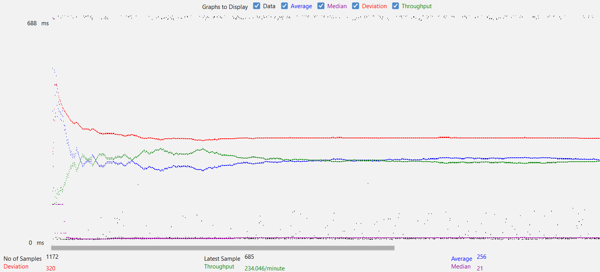

### Fabflix

Team: team-ame (#18)

Names: Thang Chau & Amy Huang

<a href="https://www.youtube.com/watch?v=EhR7hXW1vgY" target="_blank">Demo Video for Our Fabflix Web Application</a>

---

### Instructions of Deployment
**Locally in IntelliJ**  
1. Git clone the repository into IntelliJ
2. Config Tomcat Local Server -> Fix the artifact error and choose the war file
3. Click on the green run arrow to build and launch Tomcat

**Remotely on AWS**  
1. Connect to AWS instance
2. Git clone the repository and cd into the repo
3. Inside the repo, where the pom.xml file is located, build the war file: `mvn package`
4. Show tomcat web apps: `ls -lah /var/lib/tomcat10/webapps/`
5. Copy your newly built war file: `sudo cp ./target/*.war /var/lib/tomcat10/webapps/`
6. Show tomcat web apps, it should now have the new war file: `ls -lah /var/lib/tomcat10/webapps/`
7. Open Tomcat Manager Page and click on the right web app

---

### Group Contributions

Thang Chau: \
&nbsp;&nbsp;&nbsp;&nbsp; Worked on Connection Pooling \
&nbsp;&nbsp;&nbsp;&nbsp; Worked on single & scaled instances \
&nbsp;&nbsp;&nbsp;&nbsp; Worked on master/slave replication on AWS \
&nbsp;&nbsp;&nbsp;&nbsp; Worked on JMeter \
&nbsp;&nbsp;&nbsp;&nbsp; Worked on README \
&nbsp;&nbsp;&nbsp;&nbsp; Recorded Video
  
Amy Huang: \
&nbsp;&nbsp;&nbsp;&nbsp; Worked on Connection Pooling \
&nbsp;&nbsp;&nbsp;&nbsp; Tried working on master/slave replication \
&nbsp;&nbsp;&nbsp;&nbsp; Worked on README 

---

### Connection Pooling
**Include the filename/path of all code/configuration files in GitHub of using JDBC Connection Pooling.**
- [cs122b-project1/src/LoginServlet.java](/cs122b-project1/src/LoginServlet.java)
- [cs122b-project1/src/ConfirmationServlet.java](cs122b-project1/src/ConfirmationServlet.java)
- [cs122b-project1/src/DahsboardHomeServlet.java](cs122b-project1/src/DahsboardHomeServlet.java)
- [cs122b-project1/src/DashboardInsertServlet.java](cs122b-project1/src/DashboardInsertServlet.java)
- [cs122b-project1/src/DashboardLoginServlet.java](cs122b-project1/src/DashboardLoginServlet.java)
- [cs122b-project1/src/HomeServlet.java](cs122b-project1/src/HomeServlet.java)
- [cs122b-project1/src/MovieSuggestion.java](cs122b-project1/src/MovieSuggestion.java)
- [cs122b-project1/src/MoviesServlet.java](cs122b-project1/src/MoviesServlet.java)
- [cs122b-project1/src/PaymentServlet.java](cs122b-project1/src/PaymentServlet.java)
- [cs122b-project1/src/SingleMovieServlet.java](cs122b-project1/src/SingleMovieServlet.java)
- [cs122b-project1/src/SingleStarServlet.java](cs122b-project1/src/SingleStarServlet.java)
- [cs122b-project1/WebContent/META-INF/context.xml](cs122b-project1/WebContent/META-INF/context.xml)
    
**Explain how Connection Pooling is utilized in the Fabflix code.**  
The username and password of MySQL are given to JDBC through the context.xml file. JDBC uses these credentials to create a connection pool. When a servlet needs to make a connection, it requests one from this pool and returns it when the task is done. Because we are recycling connections from the connection pool, we are saving time and resources as we do not need to create a new connection each time a servlet needs one.
    
**Explain how Connection Pooling works with two backend SQL.**  
It works similar to how connection pooling is used in the Fabflix code. The main difference it that, with two backend SQL, there is a load balancer that is configured to distribute connections between the master and slave instance. SInce there is more than one database connection (i.e., both Master and Slave), there is an increase in efficiency as it saves both time and resources.

---

### Master/Slave
**Include the filename/path of all code/configuration files in GitHub of routing queries to Master/Slave SQL.**
- [cs122b-project1/src/ConfirmationServlet.java](cs122b-project1/src/ConfirmationServlet.java)
- [cs122b-project1/src/DashboardInsertServlet.java](cs122b-project1/src/DashboardInsertServlet.java)
- [cs122b-project1/src/DashboardLoginServlet.java](cs122b-project1/src/DashboardLoginServlet.java)
- [cs122b-project1/src/LoginServlet.java](cs122b-project1/src/LoginServlet.java)
- [cs122b-project1/src/PaymentServlet.java](cs122b-project1/src/PaymentServlet.java)
- [cs122b-project1/WebContent/META-INF/context.xml](cs122b-project1/WebContent/META-INF/context.xml)

**How read/write requests were routed to Master/Slave SQL?**  
The Fabflix web app allows read requests to both Master SQL and Slave SQL, but only allows write requests to the Master SQL. We added an additional resource in context.xml for master and use it as the datasource for all functions that will write new entries into the database.

---

### JMeter TS/TJ Time Logs
**Instructions of how to use the `log_processing.*` script to process the JMeter logs.**  
The `log_processing.py` file is located in the base directory of our repo. To run it, cd to the directory with the file then enter the following command in the terminal: `python3 log_processing.py [path to log_file]` 

All our time logs for this project are stored in the [log](/log) folder.

---

### JMeter TS/TJ Time Measurement Report

| **Single-instance Version Test Plan** | **Graph Results Screenshot** | **Average Query Time(ms)** | **Average Search Servlet Time(ms)** | **Average JDBC Time(ms)** | **Analysis** |
|------------------------------------------------|------------------------------|----------------------------|-------------------------------------|---------------------------|--------------|
| Case 1: HTTP/1 thread |  | 256  | 232.20203723313406 | 232.13506157216054 | Relatively short time for single thread with connection pooling. Little to no time difference between TJ and TS. |
| Case 2: HTTP/10 threads |  | 1776 | 1758.8301667214287 | 1758.6144878517857 | With 10 threads for connection pooling, we get around a 7 times increase in average query time. This is somewhat surprising since we thought it would be more like 10 times slower, but it’s possible that we experienced bad latency when testing with a single thread. |
| Case 3: HTTPS/10 threads |  | 2210 | 2196.118045384218 | 2195.90283849705 | HTTPS for 10 threads with connection pooling is quite a bit slower than HTTP for 10 threads with connection pooling which makes sense because HTTPS needs to first encrypt the data so the query times would be slower |
| Case 4: HTTP/10 threads/No connection pooling |  | 2556 | 2216.7352621014334 | 2215.775713895259 | Without connection pooling, we can see that 10 threads for HTTP will take even longer than 10 threads for HTTPS with connection pooling. Even though average query time is much longer than for HTTPS, the average TJ and TS aren’t much longer, so we suspect there being some sort of lag issue with AWS. |

| **Scaled Version Test Plan** | **Graph Results Screenshot** | **Average Query Time(ms)** | **Average Search Servlet Time(ms)** | **Average JDBC Time(ms)** | **Analysis** |
|------------------------------------------------|------------------------------|----------------------------|-------------------------------------|---------------------------|--------------|
| Case 1: HTTP/1 thread |  | 248 | 224.06647699502489 | 223.93575359701492 | The time difference between scaled and single instance for 1 thread with connection pooling is minimal. We think this makes sense because 1 thread will be tied to a single instance of either master or slave, so the average times should be quite similar. |
| Case 2: HTTP/10 threads |  | 1104 | 1075.625703781491 | 1075.4711221164157 | When scaling the webapp for 10 threads on HTTP, we see a massive improvement in average query time. This showcases the effects of load balancing. |
| Case 3: HTTP/10 threads/No connection pooling |  | 2399 | 2005.8764183359497 | 2004.8057113186812 | Even after scaling, the times we got for 10 threads HTTP without connection pooling didn’t really get much better. We believe this shows the importance of connection pooling because even if we have enabled load balancing, the constant creation and closing of new connections will take its toll on the server. |
 
---

### Android App

`Note`: Various changes were made to Movie.java, AndroidManifest.xml, and strings.xml but they are minor changes to add new getter methods, dependencies, and string keywords, so we won’t go over them.

`LoginActivity.java`: Modified the example code to check the database for the correct login information, display the proper error messages, and redirect the user to the search page if successful.
`MovieListActivity.java`: Modified the example code to display the movie list, 10 per page. Handles the Prev and Next Http requests to and responses from the server to display the new movies. When a single move is clicked on, start the SingleMovieActivity activity and send the saved data about that movie to the new activity to skip an SQL call.
`MovieListViewAdapter.java`: Modified the example code to change what content is displayed for each movie in the movie list.
`MovieSearchActivity.java`: Makes a GET request to the server to handle user search queries and send the resulting json output to MovieListActivity as a string via intent.
`SingleMovieActivity.java`: Display the data sent by MovieListActivity.

`activity_movielist.xml`: Added Next and Prev buttons, and a page number.
`activity_moviesearch.xml`: Displays a single text box and a submit button for the user’s search query input.
`singlemovie.xml`: Displays a TextView for each specified attribute of a movie.

---

### Full-text Search and Autocomplete

Implemented the autocomplete feature based on `prefix search`. If the query string has multiple keywords, each is treated as a prefix. For example, the query "good u" is first tokenized into two tokens: "good" and "u". The search results will be all the movie titles that contain a word starting with "good" and a word starting with "u", such as "The Good, The Bad and The Ugly", and "Goodbye Uncle Tom".

---

### Stored Procedure

stored-procedure.sql is stored in cs122b-project1 directory.

---

### Prepared Statements

`Note`: Since Prepared Statements do not work if placeholders are used for column names, I used String concatenation for those cases. This has been approved here according to a TA
<a href="https://edstem.org/us/courses/46270/discussion/3827614" target="_blank">here</a> (Ed Discussion)  

- ConfirmationServlet
- DashboardInsertServlet
- DashboardLoginServlet
- LoginServlet
- MoviesServlet
- PaymentServlet
- SingleMovieServlet
- SingleStarServlet
- UpdateSecurePassword

---

### Optimization Report 
We utilized `System.currentTimeMillis();` in order to compare the times. We first ran the code 5 times with the optimization set, and 5 times without the optimization set. We then compared their averages. 

1. Use Batching (execute 1000 queries at once instead of executing them one by one)
    - 21481.2 ms. vs. 29909.2 ms.
2. Use Multi-threading
	- 20165.6 ms. vs. 27248.2 ms.

Other things we took into account to make the parser faster
- Use SAX parsing instead of DOM parsing
- For each table, reuse one prepared statement instead of making a new one for each query
- set auto commit off during batching
- combined xml parser for actors and xml parser for casts into one file

---

### Inconsistency Data Report From Parsing

Inserted 12012 movies. \
54 movies duplicate. \
Inserted 34 genres. \
Found 76 inconsistent genres. \
Inserted 9561 genres_in_movies. \
Inserted 6855 stars. \
Inserted 29458 stars_in_movies. \
224 star_in_movies duplicate. \
Found 269 inconsistent movies. \
Removed 5720 movies that have no stars or genres.

---

### Substring Matching Design

`Note`: We weren’t able to get ILIKE to work for the mysql queries, so we used LOWER() LIKE instead

`LIKE`: We use the LIKE operator to check whether the user entered an input or not for a given parameter. For example, to check whether the title input is empty, we first pass on the input via setString for the prepared statement, then check whether it’s equal to “”. This is because it doesn’t matter if the user input is lowercase or uppercase because it would be empty.

`ILIKE`: We use the LOWER() LIKE operator to check for substrings. For example, to query for rows that contain the director input within their respective director names, we first pass “%” + input + “%” so that the input will be checked for both preceding and following strings. We don’t use LIKE here because a substring search shouldn’t check for the right case.

---

### Servlets

All Servlets are called from a javascript file and are used to receive data from the moviedb database.

`CartServlet`: receives data from the Cart Page and retrieves data from the session about the movies the user added to their cart and display their name, quantity, and price (all movies are priced at $42 for this assignment)

`ConfirmationServlet`: if credit card information is confirmed, receives data from the session to make insert calls to the moviedb, then empties out the cart, and display the sale records

`LoginServlet`: receives data from the Login Page and checks whether the user has entered the correct username and password (notify the user of the error if they entered the wrong information)

`HomeServlet`: receives data from the Home Page, which shows what genres and titles the users can browse by

`MoviesServlet`: receives data for the Movie List Page, handles query for both searching and browsing

`PaymentServlet`: receives data from the Payment Page and processes user input for credit card information via a POST request and displays an error message if the user’s information is wrong. If successful, redirect to confirmation

`SingleMovieServlet`: receives data for the Single Movie Page, which displays information about a single movie (i.e., title, year, director, all genres, all stars, and rating)

`SingleStarServlet`: receives data for the Single Star Page, which displays information about a particular star (i.e., name, year of birth, and all movies they had acted in)

`MovieSuggestion`: receives data for the Autocomplete feature, which displays 10 movies that meets the criteria from the search
